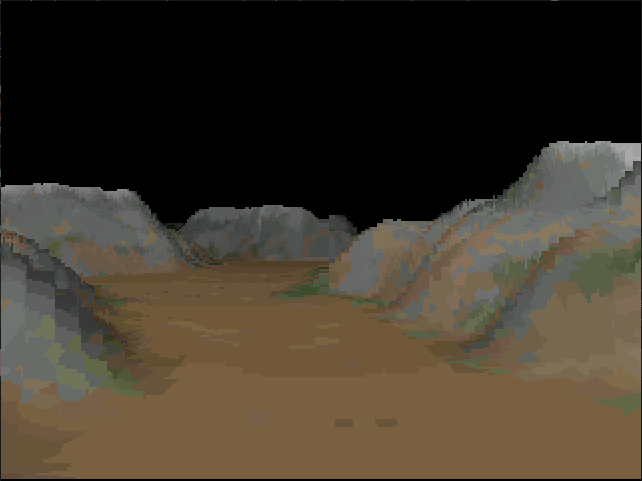
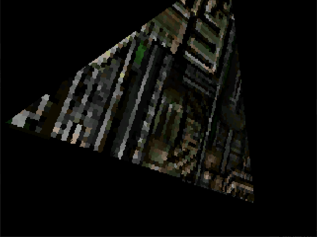
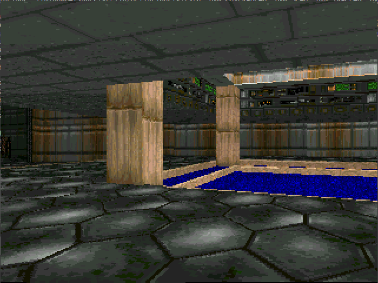
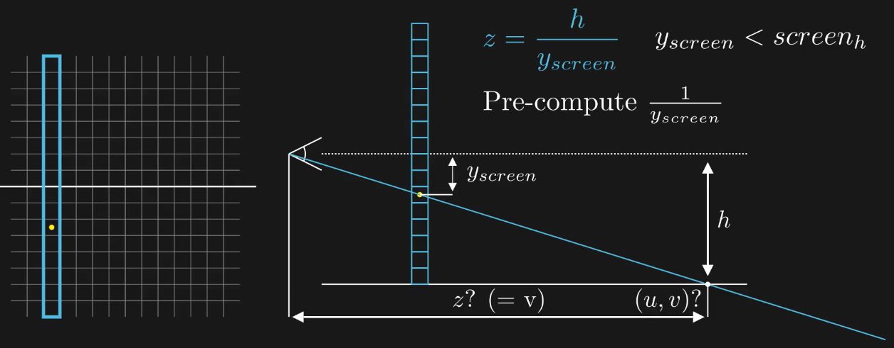

# TinyGPUs
*Making graphics hardware like its 1990, explained*

> **This is work in progress**. You're coming too soon, but feel free to peek around!

Quick links:
- [Running the demos](#running-the-demos)
  - [In simulation](#in-simulation)
  - [On the mch2022 badge](#on-the-mch2022-badge)
  - [On the icebreaker](#on-the-icebreaker)
- [The DMC-1 GPU design](#the-dmc-1-design)
  - [Context](#context)
  - [Perspective correct texturing](#perspective-correct-texturing)
  - [Discussion](#discussion)
- [Credits](#credits)

<!-- MARKDOWN-AUTO-DOCS:START (CODE:src=./demos/triangles/triangles.c) -->
<!-- MARKDOWN-AUTO-DOCS:END -->

The tinyGPUs project started with the following question: *"What would have resembled graphics hardware dedicated to our beloved retro-games from the early 90's, such as Doom 1993 and Comanche 1992?"*. This led me to creating the `DMC-1` GPU, the first (and currently only!) tiny GPU in this repository.

> **Note:** `DMC` stands for *Doom Meets Comanche*... also, it sounds cool (any resemblance to a car name is of course pure coincidence).

However, the true objective is to *explore and explain* basic graphics hardware design. Don't expect to learn anything about modern GPUs, but rather expect to learn about fundamental graphics algorithms, their elegant simplicity, and how to turn these algorithms into hardware on FPGAs. And that is *surprisingly simple*.

> **Note:** The `DMC-1` is powering my *Doom-chip "onice"* demo, about which I gave a talk at rC3 nowhere in December 2021. You can [watch it here](https://youtu.be/2ZAIIDXoBis) and [browse the slides here](https://www.antexel.com/doomchip_onice_rc3/).

> **Note:** There is a plan to do another tiny GPU, hence the *s* in tinyGPUs, exploring different design tradeoffs. But that will come later.

The tinyGPUs are written in [Silice](https://github.com/sylefeb/Silice), with bits and pieces of Verilog.

## Running the demos

For building the DMC-1 demos Silice has to be installed and in the path, please refer to the [Silice repository](https://github.com/sylefeb/Silice).

> **Note:** The build process automatically downloads files, including data files from external sources. See the download scripts [here](hardware/common/download_all.sh) and [here](demos/data/get_data.sh).

There are three main demos: `terrain`, `tetrahedron` and `doomchip-onice`.
All can be simulated, and currently run on the [mch2022 badge](https://www.bodge.team/docs/badges/mch2022/) and the [icebreaker](https://1bitsquared.com/products/icebreaker) with a SPI screen plugged in the PMOD 1A connector (details below).

<table align="center"><tr>
<td></td> <td></td> <td></td>
</tr></table>

The demos are running both on the `icebreaker` board and the `MCH2022` badge.

___
### In simulation

All demos can be run in simulation (verilator). Note that it takes a little bit of time before the rendering starts, as the full boot process (including loading code from SPIflash) is being simulating. During boot the screen remains black (on real hardware this delay is imperceptible).

For the rotating tetrahedron demo:
```
cd demos
make simulation DEMO=tetrahedron
```

For the terrain demo:
```
cd demos
make simulation DEMO=terrain
```

For the doomchip-onice demo:
```
cd demos
make simulation DEMO=doomchip-onice
```

___
### On the MCH2022 badge

Plugin the board and type:

```
cd demos
make BOARD=mch2022 DEMO=doomchip-onice program_all MCH2022_PORT=/dev/ttyACM1
```

The `program_all` target takes time as it uploads the texture pack. Once done,
use `program_code` to only upload the compiled code and `program_design` for the
design only (as long as there is power to the badge).

___
### On the icebreaker

A [240x320 SPIscreen with a ST7789 driver](https://www.waveshare.com/2inch-lcd-module.htm) has to be hooked to the PMOD 1A, following this pinout:

| PMOD1A       | SPIscreen  |
|--------------|------------|
| pin 1        | rst        |
| pin 2        | dc         |
| pin 3        | clk        |
| pin 4        | din        |
| pin 5  (GND) | screen GND |
| pin 6  (VCC) | screen VCC |
| pin 11 (GND) | cs         |
| pin 12 (VCC) | bl         |

For the rotating tetrahedron demo:
```
cd demos
make BOARD=icebreaker DEMO=tetrahedron program_all
```

For the terrain demo:
```
cd demos
make BOARD=icebreaker DEMO=terrain program_all
```

> **Note:** `program_all` takes a long time as it transfers the texture data
onto the board. After doing it once, to test other demos replace `program_all`
by `program_code`.

___
## The DMC-1 design

### Context

I started the `DMC-1` after my initial `doomchip` experiments. The [original doomchip](https://twitter.com/sylefeb/status/1258808333265514497), which is [available in the Silice repository](https://github.com/sylefeb/Silice/tree/master/projects/doomchip) was pushing the idea of running the Doom render loop *without any CPU*. This means that the entire rendering algorithm was turned into specialized logic -- a Doom dedicated chip that could not do anything else but render E1M1 ... so much fun!

I went on to design several versions, including one using SDRAM to store level and textures. This was a fun experiment, but of course the resulting design is very large because every part of the algorithm becomes a piece of a complex dedicated circuit. That might be desirable under specific circumstances, but is otherwise highly unusual. You see, normally one seeks to produce compact hardware designs, minimizing the resource usage, and in particular the number of logic gates (or their LUTs equivalent in FPGAs).

When you have (relatively) large FPGAs like the `de10-nano` or `ULX3S 85F` I was using, this is not a top concern, because the design still fits easily. But there's a lot to be said about trying to be parsimonious and make the best of the resources you have. I come from an age where computers where not powerful beyond imagination as they are today, and where optimizing was not only done for fun, it was *essential*. And when I say optimizing, I mean it in all possible ways: better algorithms (lower complexity), clever tricks, and informed low level CPU optimizations, usually directly in assembly code. Of course we could not go past the hardware. But now we can! Because thanks to FPGAs and the emergence of open source toolchains we are empowered with designing and quickly testing our own hardware!

This got me wondering. The `doomchip` is one extreme point of putting everything in hardware and redoing the entire render loop *from scratch*. The other extreme point -- also very interesting -- is to take [Doom source code](https://github.com/id-Software/DOOM) and run it on a custom SOC. There, the skills are all on [designing a very efficient hardware SOC](https://www.youtube.com/watch?v=3ZBAZ5QoCAk) with a good CPU and well thought out memory layout and cache. There are in betweens, with source ports requiring [careful engine optimizations](https://kilograham.github.io/rp2040-doom/).

> There are so many excellent ports, I am just citing a few for context here.

So the questions I asked myself were, *Could we design a GPU for Doom and other games of this era? What would its architecture be like? Could it fit on a small FPGA?*

The `DMC-1` is my take on this. Thinking beyond Doom, I thought I should also support Comanche 1992 style terrains. There are several reasons for that:
- Comanche was a sight to behold back in the days!
- Adding a terrain to Doom sounds like a huge thing.
- If I was to create a GPU for Doom, it better should come with a killer feature.

In terms of resources, I decided to primarily target the Lattice ice40 UP5K. First, this is the platform used by [the incredible source port on custom SOC by Sylvain Munaut](https://www.youtube.com/watch?v=3ZBAZ5QoCAk). Targeting anything bigger would have seemed too easy. Second, the UP5K is fairly slow (validating timing at 25 MHz is good, anything above is *very* good), and has 'only' 5K LUTs (that's not so small though, [1K LUTs can run a full 32 bits RISCV dual-core processor!](https://github.com/sylefeb/Silice/blob/master/projects/ice-v/IceVDual.md)). So this makes for a good challenge. On the upside, the UP5K has 8 DSPs (great for fast multipliers!) and 128KB of SPRAM, a fast one-cycle read/write memory. So this gives hope something can actually be achieved. Plus of course, the SPIflash ROM that is typically hooked alongside FPGAs for their configuration. These are to be considered read only (writing is very, very slow), and while reading takes multiple cycles to initialize a random access, performance is far from terrible.

At this point, you might want to watch [my video on the Doomchip on-ice](https://youtu.be/2ZAIIDXoBis) or [browse the slides here](https://www.antexel.com/doomchip_onice_rc3/). This explains how the initial design of the `DMC-1` was achieved, including perspective correct texturing for walls and flats (floors and ceilings) as well as the terrain rendering.

### Perspective correct texturing

What my talk does *not* explain, however, is the perspective correct texturing achieved on arbitrary slanted surfaces such as in the tetrahedron demo (because I did not know how to do that back then!). Consider this screenshot of E1M1:

<center></center>

As explained in the talk, all surfaces here are either entirely vertical (walls) or entirely horizontal (flats). Both cases allow a simplification enabling perspective correct texturing *without* having to perform a division in every pixel. In fact, the original Doom engine renders walls as vertical spans and flats as horizontal spans precisely for this reason (through the famous *visplane* data-structure for the latter, which the original code has a few things to say about: [`Here comes the obnoxious "visplane"`](https://github.com/id-Software/DOOM/blob/77735c3ff0772609e9c8d29e3ce2ab42ff54d20b/linuxdoom-1.10/r_plane.c#L51), [`Now what is a visplane, anyway?`](https://github.com/id-Software/DOOM/blob/77735c3ff0772609e9c8d29e3ce2ab42ff54d20b/linuxdoom-1.10/r_defs.h#L458))

This per-pixel division is a big deal, because divisions are either slow (many cycles) or use a ton of logic (many LUTs), or both! Now let's have a look at a more general surface, like this textured triangle in the tetrahedron demo:

<center></center>

This is more general because clearly the perspective is not 'axis aligned' with respect to the screen. This is neither vertical nor horizontal. Yet, this is not *free texture mapping* either: the texture is painted onto the plane of the triangle, and when seen front-facing it will show up without distortion. I refer to this case as *planar texturing*.

> I call *free texture mapping* the general case where u,v coordinates would be assigned to the triangle vertices and used to interpolate texture coordinates across the triangle surface. This interpolation also requires the per-pixel division, but I don't have a clever trick to escape this one!!

One possible approach to deal with this case is the so called z-constant raterization. This is not a very common technique and, afaik, there are not many descriptions or implementations of it. I found a description in this highly enjoyable treasure trove: an archive of the *PC Game Programmer's Encyclopedia*: [Free Direction Texture Mapping](http://qzx.com/pc-gpe/fdtm.txt) by Hannu Helminen (alongside [another great article on texturing](http://qzx.com/pc-gpe/texture.txt) by Sean Barrett).

This sounds good but I was not too keen on implementing it. Then, I looked back at how I dealt with flats in the *Doomchip onice*. You see, because I am drawing *only* vertical span, producing the screen column after column, I could not do horizontal spans like the original engine. Thus I had to deal with the perspective effect during texturing, and avoid the per-pixel division. Well, I did not *avoid it*, because it is required, but instead I *precomputed* it. Here is a figure detailing the idea (my talk features an [animated version](https://youtu.be/2ZAIIDXoBis?t=1313)):

<center></center>

On the left the screen view (each cell of the grid is a pixel). The blue column is being drawn as a piece of floor. On the right, the side view with the player eye to the left and the view ray through a pixel as a blue line. We get the *u* coordinate from the column *x* position on screen but need to compute the *v* coordinate, that is also the distance to the viewer, *z*. This is the one that requires a division, in this particular case by *y_screen*. The good news is that because *y_screen* is limited to the screen height, this can be pre-computed in a table. That is at the root of a good old [demoscene effect](https://github.com/sylefeb/Silice/blob/master/projects/vga_demo/vga_flyover3d.si):

<center></center>

Thanks to the limited range of values (screen height), this fits in a small table that is stored in a specialized FPGA memory called a BRAM. So that's highly efficient in practice.

> To be precise, given a value $n$ that goes from $1$ to $N$, we precompute a table $T$ of $N$ entries. Choose a large value $M$, typically if the table stores $b$ bits integers pick $M = 2^b$. Then precompute all $T[n] = \frac{M}{n}$ (clamp to $M-1$ when $n = 1$). For this trick to be reasonable we need $N$ to be bounded and not too large, which was the case here ($N$ being half the screen height). You can see how the table used by the GPU is generated by the pre-processor [here](https://github.com/sylefeb/tinygpus/blob/main/hardware/GPUs/dmc-1/dmc-1.si#L192-L199).

> Quick note on how to  use the precomputed division table. Let us assume we want to compute $\frac{x}{n}$, instead we will compute `(x . T[n]) >> b`, where the division by M is replaced by a shift of $b$ bits to the right (or less if we want to keep a fixed point result). Take care that the product $x . T[n]$ does not overflow.

How is this relevant to planar perspective correct texturing? Well, the question is how to generalize this principle and, more importantly, whether the required division would also be limited in range so it could be pre-computed in a small-size table.

It turns out that the answer is yes! To understand why, we have to take a different point of view, and see this as a [raytracing](https://en.wikipedia.org/wiki/Ray_tracing_(graphics)) question: Given a view ray, how do we compute the *u,v* texture coordinate when hitting a plane? There are good explanations [on this page](https://www.scratchapixel.com/lessons/3d-basic-rendering/minimal-ray-tracer-rendering-simple-shapes/ray-plane-and-ray-disk-intersection), so I won't repeat these in details here. The important point, however, is that computing these coordinates involves only dividing by the dot product of the plane normal and view ray direction (see the expression of `t` in the aforementioned page). That is good new because both vectors are *unit vectors*, so their dot product is necessarily in $[-1,1]$, giving us a limited range indeed. We can stay within $[0,1]$ by only considering front facing planes, then remap the range to $[1,N]$ and precompute divisions of a base value $M$ by this range. This is not very precise around 0, but that is when the plane is almost aligned with the view ray ('flat horizon') so we can't see much anyway.

And that's about it for the main trick enabling perspective correct *planar* texturing. In the API these are the `COLDRAW_PLANE_B` span types, which require first some setup, using `PARAMETER_PLANE_A` (specifying the normal, u and v axis coordinate along the screen y axis). An example of using the planar spans can be seen in the [Doomchip on-ice](demos/doomchip-onice/doomchip-onice.c) (simplified here for readability):

```c
    // setup per-column
    int rz = 4096;
    int cx = col_to_x[c];
    int du = dot3( cx,0,rz,  cosview,0,sinview ) >> 14;
    int dv = dot3( cx,0,rz, -sinview,0,cosview ) >> 14;
    col_send(
      PARAMETER_PLANE_A(256,0,0), // ny,uy,vy
      PARAMETER_PLANE_DTA(du,dv) | PARAMETER
    );
    // ...
    // drawing a floor span
    col_send(
        COLDRAW_PLANE_B(-sec_f_h,btm-scr_h/2),
        COLDRAW_COL(texid, b,t, light) | PLANE
    );

```
Planar spans are only used for horizontal floors/ceilings in this demo, since walls use simpler vertical spans. Because the surfaces are horizontal, the parameters to `PARAMETER_PLANE_A` are `256,0,0`: only the normal varies with the $y$ axis.

A more general use can be seen in the [tetrahedron demo](demos/tetrahedron/tetrahedron.c). In this demo the triangles are rasterized into spans on the CPU ; this can be seen in the file [raster.c](software/api/raster.c) that contains detailed comments on that process too.

### Discussion

The `DMC-1` is unusual in that it renders the screen column by column, in order. This specific choice is motivated by the fact that we stream pixels to a SPI screen that features a framebuffer, so we do not have to spend precious memory on a framebuffer FPGA-side. Also, this allows the use of a one column depth buffer, a luxury enabling simpler drawing of scenes containing both the terrain, buildings and sprites.

This however imposes a specific draw order CPU side which is not always comfortable. That is why a second tinyGPU, using a different approach and likely an additional (writable) external memory is planned ;)

___
## Credits
- Data files for terrains are downloaded from *s-macke*
[VoxelSpace repository](https://github.com/s-macke/VoxelSpace/) which also
contains excellent explanations regarding the Comanche terrain rendering algorithm.
- Doom shareware data, `doom1.wad`, is automatically downloaded and is of course
part of the original game by Id Software.
