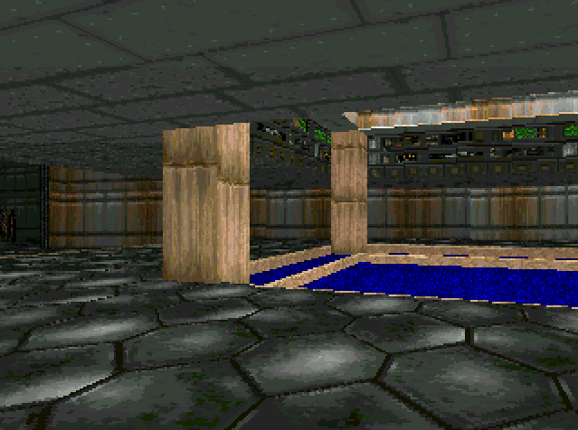

# TinyGPUs
*Making graphics hardware like its 1990, explained*

> **This is work in progress**, many parts are not yet written. You're coming too soon, but feel free to peek around!

## Objectives

The tinyGPUs project started with the following question: *"What would have resembled graphics hardware dedicated to our beloved retro-games from the early 90's, such as Doom 1993 and Comanche 1992?"*. This led me to creating the `dmc-1` GPU, the first (and currently only!) tiny GPU in this repository.

> **Note:** `dmc` stands for *Doom Meets Comanche*... also, it sounds cool (any resemblance to a car name is of course pure coincidence).

However, the true objective is to *explore and explain* basic graphics hardware design. Don't expect to learn anything about modern GPUs, but rather expect to learn about fundamental graphics algorithms, their elegant simplicity, and how to turn these algorithms into hardware on FPGAs. And that is *surprisingly simple*.

> **Note:** The `dmc-1` is powering my *Doom-chip "onice"* demo, about which I gave a talk at rC3 nowhere in December 2021. You can [watch it here](https://youtu.be/2ZAIIDXoBis) and [browse the slides here](https://www.antexel.com/doomchip_onice_rc3/).

> **Note:** There is a plan to do another tiny GPU, hence the **s** in tinyGPUs, exploring different design tradeoffs. But that will come later.

The tinyGPUs are written in [Silice](https://github.com/sylefeb/Silice), with bits and pieces of Verilog. Silice has to be installed and in the path, please refer to the [Silice repository](https://github.com/sylefeb/Silice).

## Running the demos

There are three main demos: `terrain`, `tetrahedron` and `doomchip-onice`.
All can be simulated, and currently run on the [mch2022 badge](https://www.bodge.team/docs/badges/mch2022/) and the [icebreaker](https://1bitsquared.com/products/icebreaker) with a SPI screen plugged in the PMOD 1A connector (details below).

<table align="center"><tr>
<td></td> <td></td> <td></td>
</tr></table>

The demos are running both on the `icebreaker` board and the `MCH2022` badge.

> **Note:** The build process automatically downloads files, see [here](hardware/common/download_all.sh) and [here](demos/data/get_data.sh).

___
### In simulation

For the rotating tetrahedron demo:
```
cd demos
make simulation DEMO=tetrahedron
```

For the terrain demo:
```
cd demos
make simulation DEMO=terrain
```

For the doomchip-onice demo:
```
cd demos
make simulation DEMO=doomchip-onice
```

___
### On the icebreaker

A [240x320 SPIscreen with a ST7789 driver](https://www.waveshare.com/2inch-lcd-module.htm) has to be hooked to the PMOD 1A, following this pinout:

| PMOD1A       | SPIscreen  |
|--------------|------------|
| pin 1        | rst        |
| pin 2        | dc         |
| pin 3        | clk        |
| pin 4        | din        |
| pin 5  (GND) | screen GND |
| pin 6  (VCC) | screen VCC |
| pin 11 (GND) | cs         |
| pin 12 (VCC) | bl         |

For the rotating tetrahedron demo:
```
cd demos
make BOARD=icebreaker DEMO=tetrahedron program_all
```

For the terrain demo:
```
cd demos
make BOARD=icebreaker DEMO=terrain program_all
```

> **Note:** `program_all` takes a long time as it transfers the texture data
onto the board. After doing it once, to test other demos replace `program_all`
by `program_code`.

___
### On the MCH2022 badge

Plugin the board and type:

```
cd demos
make BOARD=mch2022 DEMO=doomchip-onice program_all MCH2022_PORT=/dev/ttyACM1
```

The `program_all` target takes time as it uploads the texture pack. Once done,
use `program_code` to only upload the compiled code and `program_design` for the
design only (as long as there is power to the badge).

## Credits
- Data files for terrains are downloaded from *s-macke*
[VoxelSpace repository](https://github.com/s-macke/VoxelSpace/) which also
contains excellent explanations regarding the Comanche terrain rendering algorithm.
- Doom shareware data, `doom1.wad`, is automatically downloaded and is of course
part of the original game by Id Software.
